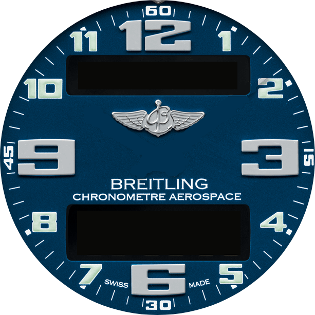
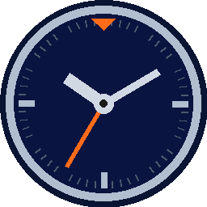

# Aviator Chrono

A Wear OS chronograph app styled after the **Breitling EVO Aerospace**, with authentic analog hands and dual amber 7-segment LCD panels. Built for Galaxy Watch 4 and later (any Wear OS 3+ device).

<p align="center">
  
  &nbsp;&nbsp;&nbsp;&nbsp;
  
</p>

---

## Features

- **Breitling EVO Aerospace dial** — authentic PNG background with bezel, Arabic numerals, and wing badge
- **Analog hands** — sword-style hour/minute (silver-white lume), aviation-red second hand, and a chrono sweep hand with a JAS aircraft bitmap at the tip
- **Chrono sweep animation** — when the chrono resets or switches to NORMAL mode, the sweep hand animates counter-clockwise back to 12 at 90°/s
- **Upper LCD panel** — shows date (`MON 07 JUL`) in NORMAL mode; switches to `CHR` or `CHR 1-100` label when the chronograph is active
- **Lower LCD panel** — shows UTC time (`HH:MM:SS`) in NORMAL mode; switches to chronograph readout when timing; a vertical divider marks the STOP|RESET / START zone boundary
- **Lap / split timer** — freeze the lower LCD at a split time while the chrono keeps running in the background; tap again to resume the live display
- **Countdown timer** — dial in a `HH:MM:SS` countdown with the bezel/rotating crown, start it from the lower LCD, and get a beep + vibration at 10s, a double beep + double vibration at 5s, and a looping alarm (sound + vibration) at zero (counts up as overtime afterward, shown as ` -:MM:SS`)
- **Four display modes** — cycled by tapping the upper LCD: `NORMAL` → `CHR` → `CHR 1/100` → `CD` → `NORMAL`
- **Five LCD colours** — tap anywhere on the dial (outside the LCD panels and hub) to cycle: Amber → Green → Red → Blue → Yellow
- **Hand parking** — tap the centre hub to park the hour hand at 3, minute hand at 9, and hide the second hand; tap again to unpark
- **Screen-awake lock** — holds the display on automatically the whole time you're on the chronograph (`CHR`/`CHR 1/100`) or countdown (`CD`) screen, running or not; only `NORMAL` mode is allowed to sleep/go ambient

---

## Usage

> For a full walkthrough of every feature (including a step-by-step countdown-timer guide), see **[docs/USER_GUIDE.md](docs/USER_GUIDE.md)**.

### Tap zones

| Zone | Action |
|---|---|
| **Upper LCD** | Cycle mode: `NORMAL` → `CHR` → `CHR 1/100` → `CD` → `NORMAL` |
| **Lower LCD — left half** | Stop chrono if running · Reset to `00:00:00` if stopped. In `CD` mode: pause the countdown if running · reset to zero if paused |
| **Lower LCD — right half** | Start chrono · Freeze lap display (2nd tap while running) · Resume live display (3rd tap). In `CD` mode: start the countdown |
| **Centre hub** | Park / unpark analog hands |
| **Dial (everywhere else)** | Cycle LCD colour |
| **Bezel / rotating crown** | In `CD` mode only: dial the countdown time — clockwise increases, counter-clockwise decreases; faster turns change it faster |

### Display modes

**Upper LCD**

| Mode | Shows |
|---|---|
| `NORMAL` | `MON 07 JUL` — current date |
| `CHR` | `CHR` — seconds precision active |
| `CHR 1/100` | `CHR 1-100` — hundredths precision active |
| `CD` | `CD` — countdown timer active |

**Lower LCD**

| Mode / State | Content | Format |
|---|---|---|
| `NORMAL` | UTC time | `HH:MM:SS` |
| `CHR` — chrono elapsed | Hours : minutes : seconds | `HH:MM:SS` |
| `CHR 1/100` — chrono elapsed | Minutes : seconds . centiseconds | `MM:SS.cc` |
| Lap frozen (any CHR mode) | Split time snapshot | same format; label shows `LAP` |
| `CD` — dialing / paused | Bezel-set countdown duration | `HH:MM:SS`; label shows `SET` |
| `CD` — running | Live remaining time | `HH:MM:SS`; label shows `CD` |
| `CD` — past zero | Elapsed overtime | ` -:MM:SS` (hour digits replaced by a blank cell + `-`, same size as `HH:MM:SS`); label shows `ALM` while the alarm is sounding |

### Countdown timer (`CD` mode)

Turn the bezel to dial in a duration — clockwise increases it, counter-clockwise decreases it, and faster turns move it faster. Tap the lower LCD's right half to start; the timer begins counting down from your dialed value **minus** however long it took you to dial it in (so it accounts for the time you spent setting it). A single beep and vibration pulse sound at 10 seconds remaining, a double beep and double vibration at 5 seconds, and a looping alarm (sound + vibration) at zero — silence it by tapping either half of the lower LCD or by turning the bezel to set a new time. The vibration is there so the alarm still gets noticed with a headset on or the watch on silent. Past zero, the display counts up as overtime with the hour digits replaced by a blank cell and a `-` sign (e.g. ` -:00:12`), keeping the figures the same size as the countdown that preceded it. You can change the time and restart at any point, including mid-countdown — turning the bezel always pauses the running timer first so you're adjusting from the current remaining time.

> **Testing in the emulator:** the on-screen crown/bezel graphic on the watch face does *not* send rotary input. Use the emulator toolbar's **⋯ → Rotary input** panel to simulate bezel/crown rotation.

---

## Building

### Requirements

- **Android Studio Hedgehog** or later (bundled JDK 17+ required)
- Wear OS emulator **or** a physical Galaxy Watch 4 / 5 / 6 / 7 (or any Wear OS 3+ device)

### Steps

1. Clone the repo:
   ```
   git clone https://github.com/Anqv/AviatorChronoApp.git
   ```
2. Open the `AviatorChronoApp` folder in Android Studio. Gradle syncs automatically.
3. Set up a target:
   - **Emulator**: Tools → Device Manager → Create Device → Wear OS → *Large Round*
   - **Physical watch**: enable Developer Options (tap build number 7×), enable ADB over Wi-Fi, then `adb connect <watch-ip>:5555`
4. Press **Run ▶** and select your target.

### Command-line build

```bash
# On Windows, point to Android Studio's bundled JDK:
JAVA_HOME="/c/Program Files/Android/Android Studio/jbr" ./gradlew assembleDebug

# Install directly to a connected watch:
JAVA_HOME="/c/Program Files/Android/Android Studio/jbr" ./gradlew installDebug
```

The APK ends up at `app/build/outputs/apk/debug/app-debug.apk`.

---

## Project layout

```
AviatorChronoApp/
├── watch_face_clean_blue.png          Breitling dial artwork (background)
└── app/src/main/
    ├── AndroidManifest.xml            Standalone Wear app; only android.permission.VIBRATE (normal, install-time)
    ├── res/drawable/
    │   ├── watch_face_clean_blue.png  Runtime copy of the dial image
    │   └── jas_plane.png              Aviation-red JAS aircraft (chrono hand tip)
    └── java/com/aviatorchrono/app/
        ├── MainActivity.kt            Compose UI, tap routing, LCD layout, animation
        ├── ChronoState.kt             Start/stop/reset/lap state machine + enums
        ├── AviatorDial.kt             Analog hands Canvas composable + colour tokens
        └── SevenSegmentDisplay.kt     7-segment digit renderer (auto-fits to panel size)
```

For a full breakdown of architecture, state machine, rendering pipeline, colour tokens, LCD geometry, and extension points see **[docs/TECHNICAL_SPEC.md](docs/TECHNICAL_SPEC.md)**.

---

## Why an app instead of a watch face

Wear OS's Watch Face Format (WFF) is declarative XML — there's no room for a real start/stop/reset state machine or a screen-lock override. A foreground **app** can hold the screen on via `FLAG_KEEP_SCREEN_ON` for as long as it stays in the foreground, which is exactly what navigation timing needs. The app appears in the watch's app list and launches like any other app.

---

## Notes

- `minSdk = 30` — targets Wear OS 3+, covering Watch 4 and every model since. No Samsung-specific APIs are used; it runs on Pixel Watch and other Wear OS 3+ devices too.
- The screen-awake lock is released immediately when the app is backgrounded (`onPause`) or the lock preference is set to OFF — it never holds the screen on unintentionally.
- The launcher icon (`mipmap-*/ic_launcher.png`) is placeholder art — swap in final artwork before publishing.
